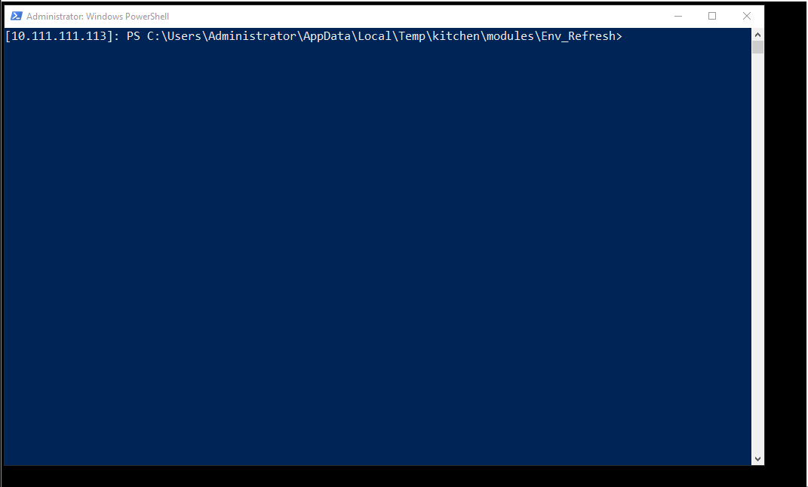

# PowerShell DSC Class based resource issue
```
OS         : Windows 2012 R2
OS Version : 6.3.9600
PSVersion  : 5.0.10586.117
```

While working on Class based DSC resource I encountered some issues and inconsistencies I can't explain.
I've created a small '<em>project</em>' help to troubleshooting: https://github.com/gaelcolas/env_refresh

The issue is, if I run the configuration in the example/ folder https://github.com/gaelcolas/Env_Refresh/blob/master/examples/dsc_configuration.ps1
It <strong>fails the first time, works the second</strong>, and then it's like <em>'works','fails' | Get-Random</em> for subsequent attempts.

The class is meant to be very simple:
https://github.com/gaelcolas/Env_Refresh/blob/master/Env_Refresh.psm1

So is the configuration:
https://github.com/gaelcolas/Env_Refresh/blob/master/examples/dsc_configuration.ps1



It's worth noting that on my laptop (Win 10 TP Fast ring), it works every time:
<pre>
OS         : Windows 10
OS Version : 10.0.14390
PSVersion  : 5.1.14390.0
</pre>

Any idea of what I might be doing wrong? Or does it sound like an issue with the WMF5 on Win2012r2?