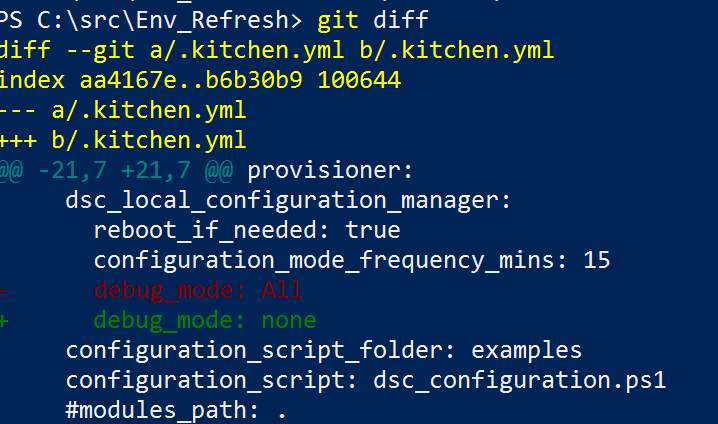

# PowerShell DSC Class based resource issue [RESOLVED]
See [this post](https://powershell.org/forums/topic/class-based-dsc-resource-intermittently-fails/#post-47427) from the powershell forum for the full discussion
```
OS         : Windows 2012 R2
OS Version : 6.3.9600
PSVersion  : 5.0.10586.117
```

While working on Class based DSC resource I encountered some issues and inconsistencies I couldn't explain.
I've created this small '<em>project</em>' to help troubleshooting.

The issue is, if I run the configuration in the example/ folder https://github.com/gaelcolas/Env_Refresh/blob/master/examples/dsc_configuration.ps1
It <strong>fails the first time, works the second</strong>, and then it's like <em>'works','fails' | Get-Random</em> for subsequent attempts.
See below example


# Explanation

There's an issue when the LCM's debug_mode is configured with anything else than *None*.
Changing this to None in my .kitchen.yml configuration or changing the LCM configuration on the test machine fixes the issue.


It's worth noting that on my laptop (Win 10 TP Fast ring), it works every time, with either setting:
<pre>
OS         : Windows 10
OS Version : 10.0.14390
PSVersion  : 5.1.14390.0
</pre>

I suspect the bug has been fixed in a recent version of WMF 5.1, unfortunately it's not GA yet. It's likely to be released along Windows 2016 [according to this post](https://blogs.msdn.microsoft.com/powershell/2016/04/06/windows-management-framework-5-0-updates-and-wmf-5-1/). 